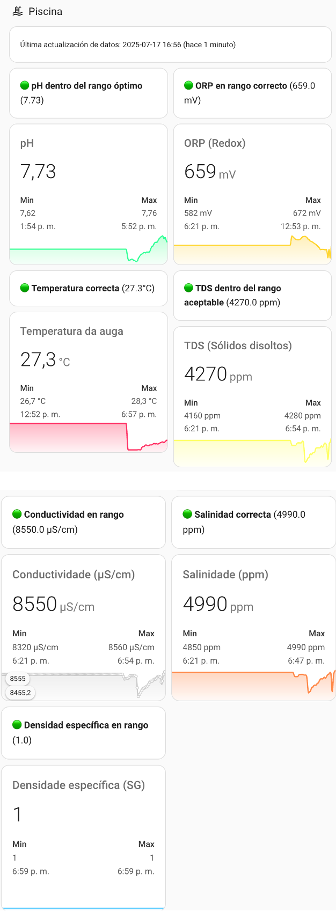

# 🏊 Home Assistant Pool Dashboard with PH-W218

This project shows how to build a smart, compact and reliable pool water quality dashboard using Home Assistant and the PH-W218 device. It includes automatic backup of the latest valid values, alerts, historical graphs and an adaptive dashboard that handles unavailable sensors.

---

## 🌐 Español

Este proyecto muestra cómo construir un dashboard inteligente, compacto y fiable para el control de calidad del agua de tu piscina usando Home Assistant y el dispositivo PH-W218. Incluye respaldo automático de los últimos valores válidos, alertas, gráficos históricos y un panel adaptativo que gestiona sensores no disponibles.

---

## 📦 Structure / Estructura

```
home-assistant-pool-dashboard-phw218/
├── configuration/
│   ├── configuration.yaml        # input_number setup
│   └── automations.yaml          # automatizaciones para backup de valores válidos
├── lovelace/
│   └── pool_dashboard.yaml       # dashboard con mini-graph-card
└── images/
    └── screenshot.png            # captura del resultado
```

---

## 🧰 Requirements / Requisitos

- Home Assistant (tested on 2024.6+)
- Integration: [LocalTuya](https://github.com/rospogrigio/localtuya)
- Lovelace card: [`mini-graph-card`](https://github.com/kalkih/mini-graph-card)
- Sensors from PH-W218:
  - pH, ORP, Temperature, TDS, Conductivity, Salinity, Specific Gravity

---

## 🔧 Setup

### 1. `configuration.yaml`

Set up all `input_number` helpers to store last known values when the sensor is offline.

📁 See [`configuration/configuration.yaml`](configuration/configuration.yaml)

---

### 2. `automations.yaml`

Set up an automation for each parameter to save the last known good value (avoids "unknown" or "unavailable").

📁 See [`configuration/automations.yaml`](configuration/automations.yaml)

---

### 3. `pool_dashboard.yaml`

Load the Lovelace dashboard using vertical-stack + mini-graph-card. It adapts dynamically if the device is off and shows when was the last update.

📁 See [`lovelace/pool_dashboard.yaml`](lovelace/pool_dashboard.yaml)

---

## 🖼 Preview / Vista previa



---

## 👤 Author

Created by [@yuanca-tech](https://github.com/yuanca-tech)

---

## 🪪 License

MIT License — free to use, modify and share.